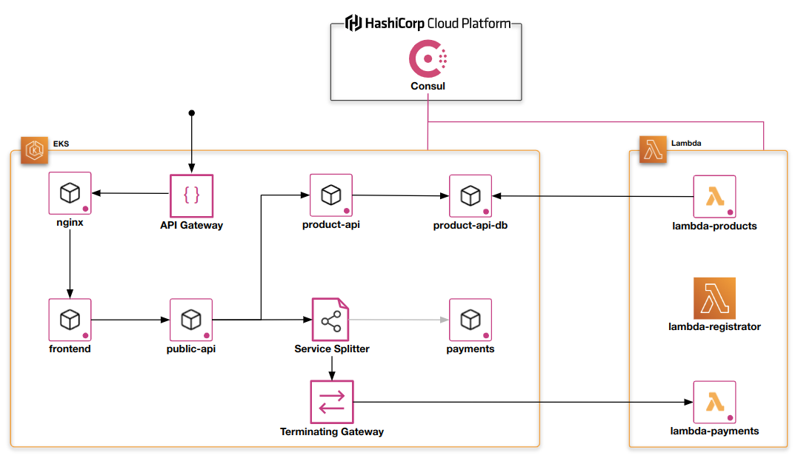

# Consul Lambda Demo

This project showcases Consul's AWS multi-runtime support with AWS EKS and Lambda.

Below is a list of resources for taking the next steps to integrating your AWS Lambda functions with your Consul service mesh:
- [Docs: Consul on AWS Lambda](https://developer.hashicorp.com/consul/docs/lambda) - The official Consul documentation for AWS Lambda integration.
- [Github: Consul on AWS Lambda](https://github.com/hashicorp/terraform-aws-consul-lambda) - OSS repository that contains all the source code for Lambda Registrator and the Consul-Lambda extension.
- [Tutorial: Extend your Service Mesh to Support AWS Lambda](https://developer.hashicorp.com/consul/tutorials/developer-mesh/serverless-consul-with-lambda) - Official tutorial for adding AWS Lambda to your Consul service mesh.
- [Video: Consul Service Mesh on Amazon EKS and AWS Lambda](https://www.youtube.com/watch?v=wgPPALAKuXI) - AWS Containers from the Couch: Sai Vennam (@svennam92) hosts this deep dive into Consul's new architecture with Iryna Shustava (@ishustava), and support for AWS Lambda with Chris Thain (@cthain). Includes live demos!

## Architecture

This demo deploys the HashiCups demo application on Amazon Elastic Kubernetes Service (EKS) and connects all the components using Consul service mesh.
The Consul server is deployed and managed using the HashiCorp Cloud Platform (HCP).
AWS Lambda functions are deployed during the demo and configured as part of the Consul service mesh.

The architecture of the system at the end of the demo is presented in the figure below.



## Requirements

This project requires the following:

- [AWS account](https://aws.amazon.com/)
- [HCP account](https://cloud.hashicorp.com/)
- [`aws` CLI](https://aws.amazon.com/cli/)
- [`curl`](https://curl.se/)
- [`docker`](https://www.docker.com/)
- [`go`](https://go.dev/)
- [`jq`](https://stedolan.github.io/jq/)
- [`kubectl` v1.23.8](https://kubernetes.io/docs/tasks/tools/)
- [`terraform` v1.3.x](https://releases.hashicorp.com/terraform/)

## Usage

**Note: _Running the steps in this demo will create resources that are not eligible for the AWS free-tier and will generate costs to your AWS account_.**

### Deploy the demo infrastructure

Deploy the AWS infrastructure and the HashiCups demo application using Terraform.

```shell
terraform init && terraform apply -auto-approve
```

### Run the demo

The `runbook` script automates all the steps to deploy the AWS Lambda functions into the Consul service mesh.
It walks you through the demo and provides prompts for each step of the way.

```
./runbook
```

If you're interested in how the demo works take a look at the `runbook`. It's just a `bash` script.

### Reset the demo

If you want to run the demo over again, you can use the `runbook reset` command.
This command resets the demo to its original state.
It removes the AWS Lambda components from the service mesh and clears the database.

The `runbook reset` command is idempotent and can be run repeatedly any number of times.

```
./runbook reset
```

### Clean up all resources

When you're done, make sure that you clean up all your resources.

```
./runbook reset -f
terraform destroy -auto-approve
```
